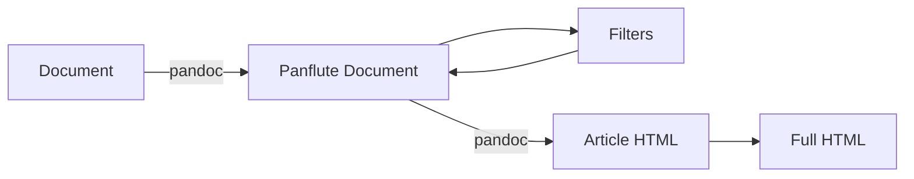

<div align="center">

# Cyberspace Static Site Generator

<p align = "center">
  
</p>

A static site generator ([SSG](https://en.wikipedia.org/wiki/Static_site_generator)) for my personal website.

</div>

# Description

This repo contains the source code and documents for my personal website. My first website was written in 2017 with raw HTML/CSS and has unfortunately been abandoned for many years (writing each page like that is no fun). This project started around 2023, as a spin-off from a Python djot parser I was writing. I figured if I could turn simple documents like djot into HTML I might as well fix up my old website.


### Features
  - Easily extensible via filters
    - Mermaid JS charts
    - GitHub alerts (see [Markdown Alerts](https://github.com/orgs/community/discussions/16925))
    - Syntax highlighting (580+ languages)
    - Tabs
    - Table of contents (TOC)
  - Uses git to manage created / edited dates
  - Page metadata
  - Automatic anchors for page elements
  - Generated navigation bar with TOC
  - Supports 60+ document types as input

### Top-Level Directories

```bash
.
├── src             # Source files for the SSG
├── text            # Raw documents to become web pages
├── web             # Contains all web related files
├── .gitignore      # Prevents the upload of build files
├── pyproject.toml  # Python project settings
└── README.md       # This document
```

# Installation

To speed up development, I've made use of some other libraries. These will be installed automatically by pip.

- [Pygments](https://pygments.org/): Syntax highlighting for nearly 580+ languages.
- [Pandoc](https://pandoc.org/): Document to HTML conversion
- [Panflute](https://github.com/sergiocorreia/panflute): Easy editing of pandoc documents
- [dominate](https://github.com/Knio/dominate/tree/master): HTML templating in Python

To install this package, you must have Python 3.12 and pip.

```bash
$ pip3 install git+https://github.com/ZX-80/Cyberspace
```

For more installation instructions using git, see [VCS Support](https://pip.pypa.io/en/stable/topics/vcs-support/#git).

> This package is mainly for my personal use, but if you do decide to use it, feel free to open any issues, pull requests, etc. Personally I'd recommend making your own, as static site generators can make for a fun project!

# Usage

The module can be called via python with `python3 -m cyberspace_ssg <command>` or directly with `cyberspace <command>`.

### Common arguments

These arguments are provided from any subcommand. 

```bash
$ cyberspace --help  # Display help screen
$ cyberspace -h
$ cyberspace --silent  # Only display error logs
$ cyberspace -s
$ cyberspace --verbose  # Display all logs, including debug
$ cyberspace -v 
```

### Build sub-command

Builds the HTML files based on the source and web directory files.  No directory structure is required for source. The default web directory structure is described in `config.py`. View the structure of this repo for an example.

```bash
$ cyberspace build ./source ./web 
```

### Serve sub-command

The same as `python3 -m http.server`, but makes the `.html` extension optional and redirects error code to their pages if they exist (e.g. `404.html`). This was done to mimic GitHub pages. The website can then be viewed at `http://localhost:8000` (or whichever port you choose).

```bash
$ PORT=8000
$ cyberspace serve $PORT ./web
```

## Build Stages

When you first run `build`, it'll scan for css files, top-level source files (for the navigation bar), and filters. Then it will run each source file in the source directory through the following stages:

1. Convert the document to a panflute document
2. Apply filters one by one
3. Convert the panflute document into the article HTML
4. Wrap the article HTML to get the page HTML



# Licensing

The source code, and any code provided on the website, is available under the [MPL](https://www.mozilla.org/en-US/MPL/2.0/).
Unless stated otherwise, all content for this site is published under [CC-BY-SA](https://creativecommons.org/licenses/by-sa/4.0/).
